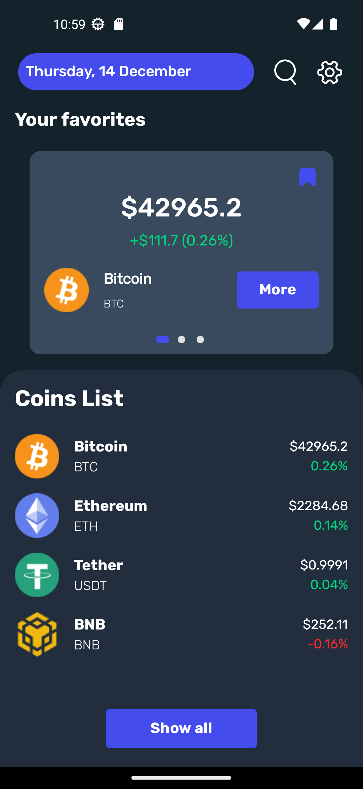
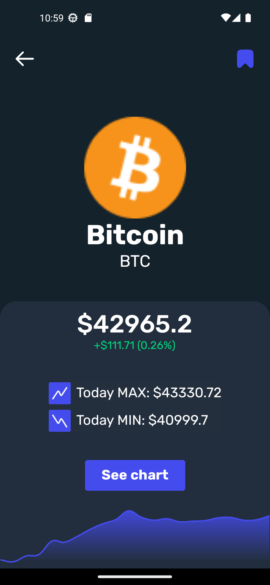
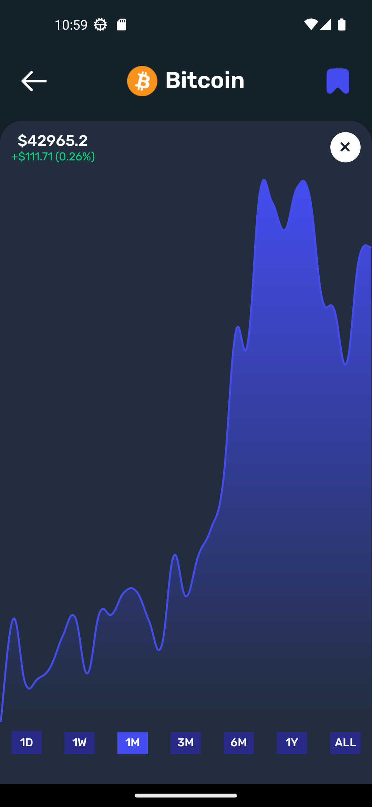
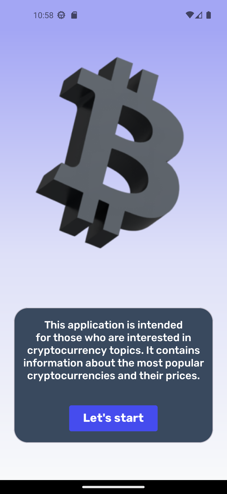
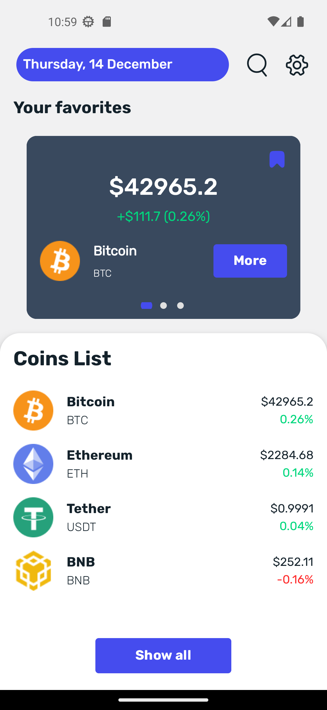
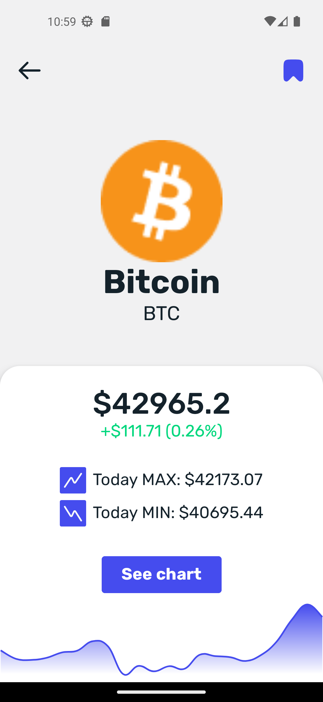
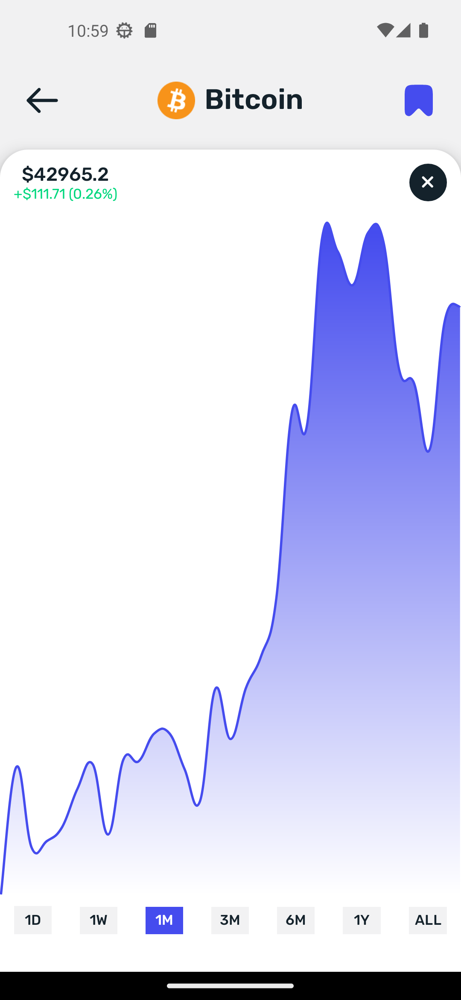

# CoinCheck

## О проекте

Данное приложение было разработано как пет-проект. Данное приложение отображает список популярных криптовалют, их цены, графики их цен и другую информацию

### Задачи, которые стояли при разработке:

- Сверстать UI, по подготовленному дизайну;
- Разработать приложение, с использованием архитектуры Clean Architecture и паттерна MVVM, с добавлением анимаций и сменой языков и тем.

## Технический стек:

- Kotlin
- Clean Architecture
- MVVM
- ViewBinding
- Многомодульность

### Библиотеки:

- Coroutines
- Lifecycle(LiveData, ViewModel)
- Navigation
- Glide
- WilliamChart
- SplashScreen
- Room
- Retrofit
- GSON
- OkHttp

## Скриншоты

  
  
  
  

 

  
  
  
  

 

